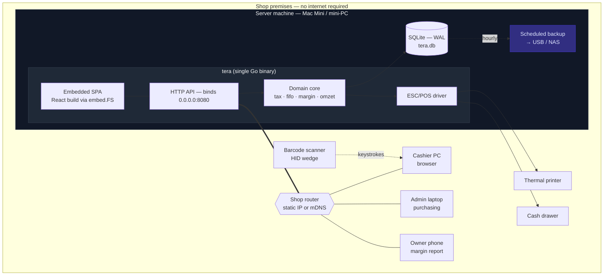
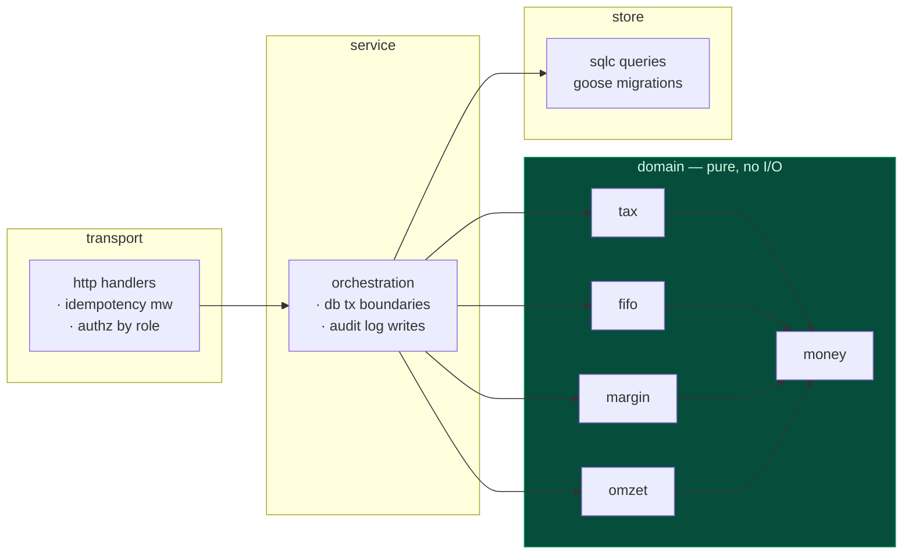
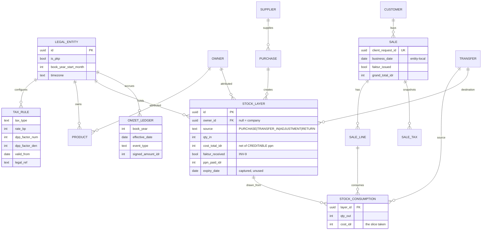
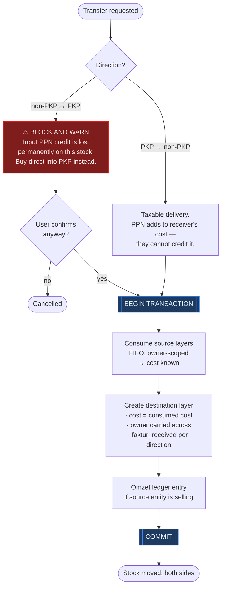

# ARCHITECTURE — Tera

## 1. Deployment: LAN server

One machine holds the data. Everything else is a browser on the shop's own network.



**"Offline" means no internet, not no network.** Their internet is unreliable; their router is not. Separating those is what keeps this simple.

**Why no per-device databases.** Two devices consuming the same FIFO layer has no clean merge answer — you'd be inventing conflict semantics for stock that physically can't be in two places. At under 1,000 transactions/day and fewer than 10 users, a single writer is orders of magnitude within budget. Rejected deliberately, not by omission.

**The single point of failure is the server machine.** Accepted (R8.7), mitigated by hourly snapshots to removable storage plus a *tested* restore-onto-any-laptop procedure. Test the restore — an untested backup is a rumour.

---

## 2. Layering

The rule: **domain packages import nothing from `database/sql` or `net/http`.** Pure functions over value types. That's what makes the tax engine, FIFO, and margin testable — and those three are the product.



One-way dependencies, inward. `money` is the only shared leaf.

---

## 3. Data model



Three things to notice.

`STOCK_LAYER` and `STOCK_CONSUMPTION` are both append-only (INV-7) — remaining quantity is derived, never stored. That's what lets a margin figure decompose down to which layer a sale drew from, months later.

`faktur_received` sits on the **layer**, not the purchase header. A purchase can't change a layer's cost basis after the fact, and the layer is what margin reads.

`owner_id` is on both the product and the layer. The product is the default; the layer is the truth, because a transfer can move stock without changing who owns it.

---

## 4. Sale flow

```mermaid
sequenceDiagram
    autonumber
    participant C as Cashier browser
    participant A as API
    participant F as fifo
    participant T as tax
    participant DB as SQLite
    participant P as Printer

    C->>A: POST /sales {client_request_id, lines, payment}
    Note over A: idempotency check — replay returns the original

    A->>DB: load open layers for (entity, product, owner)
    A->>F: Consume(lines, layers)
    Note over F: oldest acquired_at first,<br/>scoped to the OWNER.<br/>insufficient → error, never<br/>fall back to another owner
    F-->>A: consumptions[] + COGS

    A->>DB: load tax_rules valid at now
    A->>T: Calculate(cart, rules, entity.is_pkp)
    Note over T: non-PKP → no PPN at all<br/>PKP → owes output PPN even<br/>if no faktur issued
    T-->>A: TaxBreakdown

    rect rgb(30,41,59)
    Note over A,DB: one database transaction
    A->>DB: INSERT sale (+ business_date, book_year in entity TZ)
    A->>DB: INSERT sale_line[]
    A->>DB: INSERT stock_consumption[]
    A->>DB: INSERT sale_tax[] — snapshot rate + dpp fraction
    A->>DB: INSERT omzet_ledger {SALE, +amount}
    end

    A->>P: ESC/POS receipt + drawer pulse
    A-->>C: 201 {sale, omzet_status}
```



---

## 5. Inter-company transfer

The flow Olsera gets wrong. Both sides commit or neither does.



The warning fires **before** the commit. Afterwards the credit is gone and there's nothing to act on — same shape as the omzet alarm, where the entire value is in the timing.

---

## 6. Repo layout

```
tera/
├── CLAUDE.md
├── docs/{REQUIREMENTS,SPEC,ARCHITECTURE,TASKS}.md
├── cmd/tera/main.go
├── internal/
│   ├── domain/                    # pure. no sql, no http.
│   │   ├── money/
│   │   ├── tax/                   # PPN, PKP-dependent behaviour
│   │   ├── fifo/                  # ← layers, consumption, owner scoping
│   │   ├── margin/                # ← per-owner. money moves on this.
│   │   └── omzet/                 # book-year window, alarm
│   ├── service/                   # orchestration, tx boundaries, audit
│   ├── store/
│   │   ├── migrations/            # goose, forward-only
│   │   ├── queries/               # sqlc
│   │   └── seed/                  # Aug-2026 tax rules + legal_ref
│   ├── transport/http/            # handlers, idempotency, role authz
│   └── hardware/escpos/
├── web/                           # React + TS + Vite → embedded
└── testdata/
    └── worked_examples/           # DJP cases, FIFO scenarios
```

---

## 7. Deliberate non-choices

| Rejected | Why |
|---|---|
| Per-device DB + sync | No clean merge for concurrent FIFO layer consumption. Solves a problem this business doesn't have. |
| Postgres | Nothing here needs it. SQLite backup is a file copy. |
| Electron / Tauri | Clients are browsers on the LAN; no native shell needed. Printing happens server-side. |
| ORM | The FIFO and margin queries are the interesting part. Keep them legible. |
| Mutable stock balances | Destroys the audit trail that owner settlement depends on (INV-7). |
| Average costing | User chose FIFO. Average would also make "which layer" undecidable in the drill-down. |
| Fork Odoo / ERPNext / OSPOS | Evaluated earlier. None models per-owner margin or PKP-dependent input credit; retrofitting costs more than it saves. |

Keep data access free of SQLite-only SQL where it's cheap, so a future hosted tier stays a config change rather than a rewrite. A separate proposal will compare this local model against hosted — nothing here should foreclose it.
